# Infininews basics

## Commits details with screenshots :

### Commit 0 : Initial commit from Create Next App

...

### Commit 1 : Basic Redux Username custom hooks + test

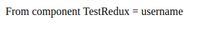

### Commit 2 : Add MaterialUI + Test button

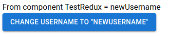

### Commit 3 : NewsAPI Server Actions + typescript types

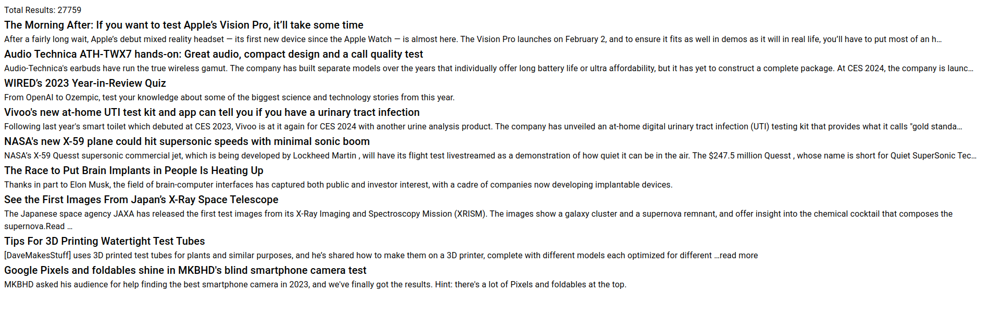

### Commit 4 : Dynamic Routing [searchquery], API call test /interpol

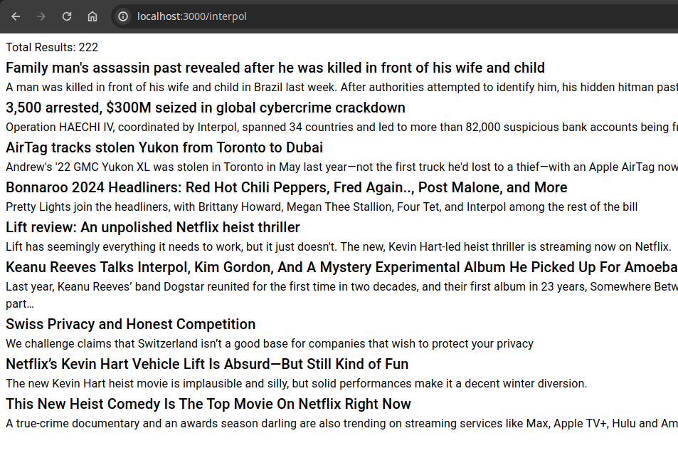

### Commit 5 : MUI Card for Articles + Grid layout

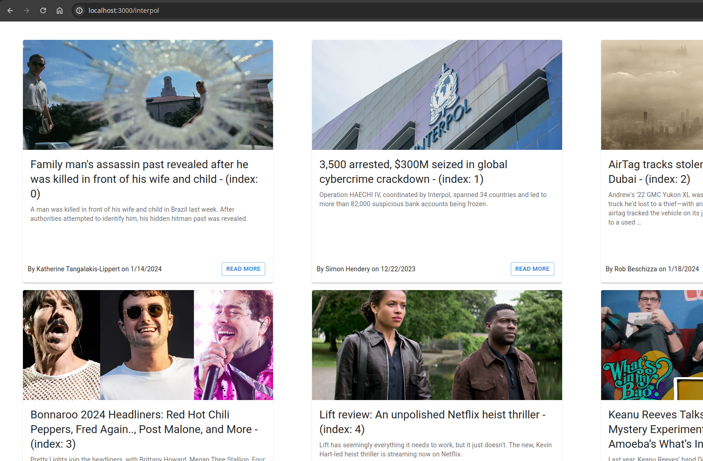

### Commit 6 : Side Menu Link with router next/navigation

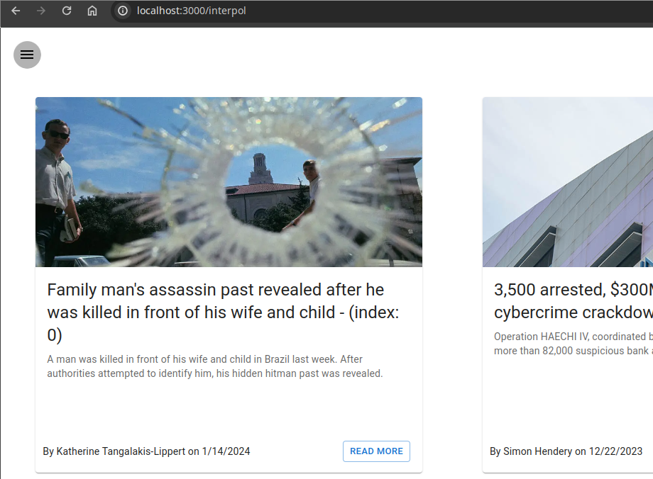
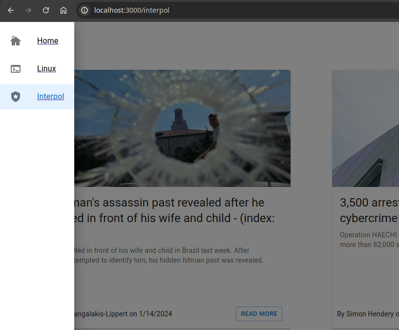
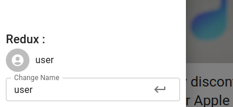
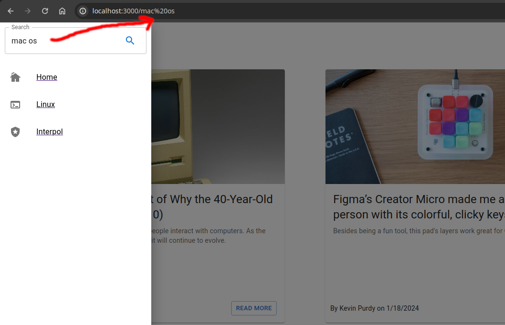

### Commit 7 : Add skeletons

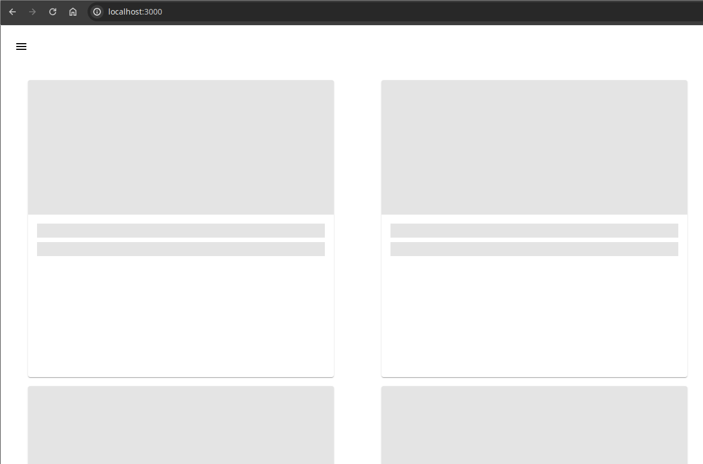
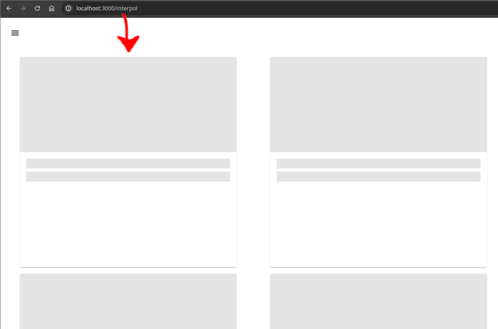

### Commit 8 : Infinite news / react-intersection-observer

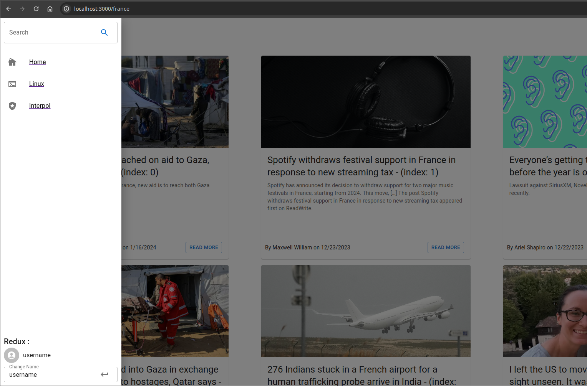

## TODO ideas, not prod-ready ofc

- better CSS with custom themes and dark mode
- optimizing/debugging some rerendering
- real error management. manage disconnect/loose internet...
- controller in fetch to avoid updating old data
- branch for Redux saga middleware and more server components
- check for new duplicate (possible because the list is always updating, no version in API)
- specific interface for mobile/touchscreens
- better interface for slow internet
- load news 1 by 1 with skeleton would be good
...
